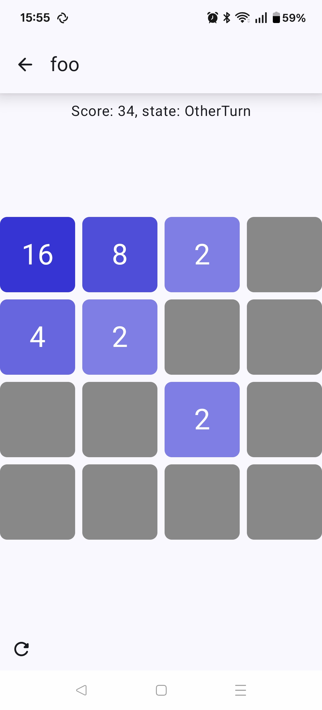

\chapter{Descripción de la solución propuesta}
\label{chap:solution}

<!--
  Se debe describir técnicamente el producto final con funcionalidades,
  capturas de pantalla, diagramas de flujo, etc.

  En este apartado se incluirá algún modo de probar el desarrollo realizado,
  bien mediante un enlace a la aplicación desplegada en algún servidor (si
  aplica al tipo de proyecto), un enlace al ejecutable o instalable (.exe,
  .apk, etc.), o si no aplica ninguna de estas, un vídeo demostrativo.
-->

En esta sección se presenta el software resultante del proyecto, se describirá
su funcionalidad, y se proveerán ejemplos de uso. Se proporcionará acceso a una
demo para Android.

# Acceso

Siendo una biblioteca de software, el producto principal está en el
repositorio, accesible tanto en [GitHub](https://github.com/emilio/ngn), como
en el [mirror personal](https://crisal.io/git/?p=ngn.git;a=summary).

La demo de Android se puede compilar con Android Studio, o descargar desde
[GitHub Releases](https://github.com/emilio/ngn/releases).

# Estructura general del proyecto

A continuación se expone una visión simplificada de la estructura del proyecto:

```
├── Cargo.toml
├── doc
├── examples
│   ├── android
│   └── dbus
├── LICENSE
├── README.md
├── src
│   ├── lib.rs
│   ├── platform
│   │   ├── android
│   │   │   ├── mod.rs
│   │   │   └── src/main/java/io/crisal/ngn
│   │   │       ├── NgnListener.kt
│   │   │       └── NgnSessionProxy.java
│   │   ├── dbus
│   │   │   ├── mod.rs
│   │   │   ├── store.rs
│   │   │   └── wpa_supplicant
│   │   └── mod.rs
│   ├── protocol
│   │   ├── encryption.rs
│   │   ├── identity.rs
│   │   ├── key_exchange.rs
│   │   ├── mod.rs
│   │   └── signing.rs
│   └── utils.rs
└── test
    ├── dbus-system-bus-mock.conf
    ├── setup-android.sh
    ├── setup.sh
    └── simple.conf
```

Todo el proyecto es parte del mismo paquete de `cargo`, definido en
`Cargo.toml`. Ahí es donde los datos básicos y dependencias están declaradas:

```toml
[package]
name = "ngn"
version = "0.1.0"
edition = "..."
license = "..."
# ...

[lib]
name = "ngn"
crate-type = ["cdylib", "lib"]

[dependencies]
tokio = { version = "1", features = ["full"] }
# ...
[target.'cfg(target_os = "android")'.dependencies]
jni = "0.21"
# ...
```

También donde se declaran la estructura y dependencias de la demo de Linux, que
vive en `examples/dbus`:

```toml
[dev-dependencies]
gtk = { version = "0.9.6", package = "gtk4", features = ["v4_18"] }
adw = { version = "0.7.2", package = "libadwaita", features = ["v1_4"] }

[[example]]
name = "dbus"
crate-type = ["bin"]
```

El código de Android también se divide en dos. La biblioteca, en
`src/platform/android`, con su parte de Java / Kotlin en
`src/platform/android/src/main/java/io/crisal/ngn`, y la aplicación de
demostración en `examples/android`.

Por conveniencia, se ha usado [`tokio`](https://tokio.rs/) como
*[runtime](https://www.ncameron.org/blog/what-is-an-async-runtime/)* asíncrona.
El uso de tokio en la biblioteca no es particularmente especial y se podrían
soportar varias *runtimes* sin problema.

# Interfaces y estructuras principales

## `P2PSession` y `P2PSessionListener`

La interfaz principal de la biblioteca está en `src/lib.rs`, donde se define el
\gls{trait} `P2PSession`, cuya implementación varía por plataforma, y es la que
expone métodos para iniciar el descubrimiento de dispositivos
(`discover_peers`), conectarse (`connect_to_peer`) y enviar mensajes
(`message_peer`):

```rust
#[async_trait::async_trait]
pub trait P2PSession: Sized + Debug + Send + Sync + 'static {
    async fn new(
        args: Self::InitArgs<'_>,
        listener: Arc<dyn P2PSessionListener<Self>>,
    ) -> GenericResult<Arc<Self>>;
    async fn stop(&self) -> GenericResult<()>;
    async fn wait(&self) -> GenericResult<()>;
    async fn discover_peers(&self) -> GenericResult<()>;
    fn peer_identity(&self, id: PeerId) -> Option<protocol::PeerIdentity>;
    fn all_peers(&self) -> Vec<(PeerId, protocol::PeerIdentity)>;
    fn own_identity(&self) -> &protocol::identity::OwnIdentity;
    async fn connect_to_peer(&self, id: PeerId) -> GenericResult<()>;
    async fn message_peer(&self, id: PeerId, message: &[u8]) -> GenericResult<()>;
}
```

La inicialización de la sesión requiere un `P2PSessionListener`, que es la
forma de reaccionar a cambios de manera asíncrona. La implementación por
defecto simplemente loguea los eventos.

```rust
pub trait P2PSessionListener<S: P2PSession>: Debug + Send + Sync {
    fn peer_discovered(&self, _: &S, peer_id: PeerId);
    fn peer_lost(&self, _: &S, peer_id: PeerId);
    fn peer_discovery_stopped(&self, _: &S);
    fn joined_group(&self, _: &S, group_id: GroupId, is_go: bool);
    fn left_group(&self, _: &S, group_id: GroupId, is_go: bool);
    fn peer_joined_group(&self, _: &S, group_id: GroupId, peer_id: PeerId);
    fn peer_left_group(&self, _: &S, group_id: GroupId, peer_id: PeerId);
    fn peer_messaged(&self, _: &S, peer_id: PeerId, group_id: GroupId, message: &[u8]);
}
```

## Identificación de dispositivos y grupos
\label{subsec:handles}

Los identificadores que se usan para el enrutamiento de mensajes (`PeerId` y
`GroupId`) son independientes de la capa de transporte y plataforma. Son
simplemente un *handle* de 64 bits:

```rust
#[repr(transparent)]
#[derive(Copy, Clone, Debug, Eq, PartialEq, PartialOrd, Ord, Hash)]
pub struct PeerId(pub(crate) handy::Handle);

#[repr(transparent)]
#[derive(Copy, Clone, Debug, Eq, PartialEq, PartialOrd, Ord, Hash)]
pub struct GroupId(pub(crate) handy::Handle);
```

El enrutamiento de mensajes a un `PeerId` es independiente del grupo físico
(`GroupId`) al que está conectado. El grupo físico se expone ahora mismo en el
`Listener`, pero es probable que se elimine porque no es necesario y es
probable que en otras capas de transporte no haya múltiples grupos.

La identidad *lógica* de un dispositivo (independiente de la capa de
transporte) es simplemente un *nick* (nombre) y una clave criptográfica:

```rust
#[derive(Debug)]
pub struct OwnIdentity {
    pub nickname: String,
    pub key_pair: KeyPair,
}

#[derive(Encode, Decode, Debug, PartialEq, Eq, Clone)]
pub struct LogicalPeerIdentity {
    pub nickname: String,
    pub key: MaybeInvalidPublicKey,
}
```

# Enrutado de mensajes en WiFi Direct

Cuando se forma un grupo de WiFi Direct, hay efectivamente dos modos de
operación. En cada grupo, hay un GO o *Group Owner*, y el resto de miembros son
clientes.

Los clientes se pueden comunicar entre sí sin pasar por el GO **una vez sepan su
dirección IP**, pero es el GO el que tiene que encargarse de comunicar la
existencia de nuevos miembros a los existentes.

Durante la formación del grupo, la única dirección IP que podemos saber por
adelantado en todas las plataformas es la dirección del GO. En el mundo ideal,
podríamos depender the las direcciones de link local \cite{rfc4862}, para
obtener una dirección dada la dirección MAC de la interfaz, pero Android no la
expone, y aunque puedes [solicitar el uso de
IPv6](https://developer.android.com/reference/android/net/wifi/p2p/WifiP2pConfig#GROUP_CLIENT_IP_PROVISIONING_MODE_IPV6_LINK_LOCAL),
es una API bastante reciente.

Por lo tanto la solución que se adoptó establece **dos canales** por cada
cliente, un canal de *control* no cifrado para la gestión del grupo e
intercambio de claves, y uno para la comunicación cifrada y firmada de
mensajes entre dispositivos.

El único puerto que tiene que ser conocido de antemano es el del canal de
control del *Group Owner*, el cual está definido en `src/protocol/mod.rs`:

```rust
/// The port the GO of the group listens to.
pub const GO_CONTROL_PORT: u16 = 9001;
```

El resto de puertos son dinámicos.


# Criptografía
\label{sec:crypto}

La solución propuesta implementa cifrado punto a punto usando el cifrado
simétrico \Gls{AES}-256-\Gls{GCM}, con un intercambio de claves usando
\Gls{ECDH} con el algoritmo X25519 \cite{rfc7748} para la generación de claves
efímeras.

Adicionalmente, los mensajes entre los clientes están firmados con su clave de
identidad, que es una clave [ed25519](https://ed25519.cr.yp.to/).

Nótese que esta firma es innecesaria para la seguridad de la transmisión, ya
que que el mensaje está intacto también es garantizado por el algoritmo de
cifrado. Sin embargo, garantiza que quien lo envía es quien dice ser, en caso
de que hubiera un \Gls{MITM} durante el intercambio de claves.

A pesar de que en el prototipo las claves de identidad son efímeras por
conveniencia (no se ha implementado persistencia ni una base de datos de
identidades conocidas), la idea es que estas claves ed25519 pudieran ser
persistentes. \label{subsec:ephemeral-identities}

El cifrado (una vez se han acordado las claves correspondientes) y la firma de
los mensajes son relativamente sencillos, por lo que no se indagará mucho más
en profundidad en ellos en esta sección. Viven en `src/protocol/encryption.rs`
y `src/protocol/signature.rs`, respectivamente.

La clave de cifrado es efímera para cada sesión de comunicación entre dos
clientes, y está generada tras el proceso de intercambio de claves descrito en
\cref{subsec:keyexchange}.

La clave de firma se especifica durante la creación de la sesión y su parte
pública se envía como parte del mensaje de asociación a cualquiera de los
clientes.

## Intercambio de claves
\label{subsec:keyexchange}

El código que encapsula el intercambio de claves vive en
`src/protocol/key_exchange.rs`. El sistema de tipos de Rust garantiza que no
podamos usar una clave efímera (`EphemeralPrivateKey`) para más de una
operación de intercambio.

```rust
#[derive(Debug)]
enum KeyExchangeState {
    InProgress(PrivateKey),
    Completed(Arc<super::encryption::Keys>),
    Errored,
}

#[derive(Debug)]
pub struct KeyExchange {
    public_key: PublicKey,
    state: State,
}
```

Cuando se descubre un cliente nuevo, se crea un objeto `KeyExchange` en el
estado `InProgress`, con una clave privada:

```rust
impl KeyExchange {
    pub fn new() -> Result<Self, Unspecified> {
        let private = ring::agreement::EphemeralPrivateKey::generate(
            &X25519,
            &ring::rand::SystemRandom::new(),
        )?;
        let public_key = private.compute_public_key()?;
        Ok(Self {
            public_key,
            state: State::InProgress(private),
        })
    }
}
```

La clave pública se exporta en el mensaje de asociación:

```rust
impl KeyExchange {
    pub fn export_public_key(&self) -> MaybeInvalidPublicKey {
        MaybeInvalidPublicKey(self.public_key.as_ref().try_into().unwrap())
    }
}
```

Cuando recibimos la clave del otro cliente, se reemplaza el estado `InProgress`
con `Errored` (en caso de algún error criptográfico), o `Completed`, con la
clave AES256 usada para cifrar y descifrar mensajes:

```rust
impl KeyExchange {
    pub fn finish(&mut self, peer_key: &MaybeInvalidPublicKey) -> GenericResult<()> {
        if !matches!(self.state, KeyExchangeState::InProgress(..)) {
            return Err(trivial_error!("Exchange already completed"));
        }
        let result = std::mem::replace(&mut self.state, State::Errored);
        self.state = match result {
            KeyExchangeState::InProgress(private) => {
                let peer_key = UnparsedPublicKey::new(
                    &X25519,
                    &peer_key.0[..]
                );
                State::Completed(Arc::new(
                    Keys::from_shared_secret(private, peer_key)?
                ))
            }
            _ => unreachable!(),
        };
        Ok(())
    }
}
```

# Formato y envío de mensajes

El formato de mensaje es común para tanto el canal de control como el de
comunicación.

Consiste en una cabecera de 64 bits con un número mágico de 16 bits (`0xdead`),
un número de version de 16 bits (del cual se podrían usar 8 para flags varias,
ya que la versión actual sería siempre `1`), y la longitud del mensaje binario
en 32 bits.

Los mensajes del canal de control no van cifrados ni firmados, mientras que los
mensajes entre clientes sí. Las rutinas de envío de mensajes se encargan de
cifrar/descifrar y firmar/validar el mensaje de forma transparente.

Las rutinas de envío y recepción de mensajes son totalmente ajenas al formato
que usen los clientes. De hecho, la demo de Linux intercambia cadenas de
caracteres planas, y la demo de Android intercambia JSON, por ejemplo.

Para el canal de control se ha utilizado
[bincode](https://crates.io/crates/bincode) para codificar los mensajes de
control, ya que junto a las capacidades de meta-programación de Rust permite
derivar la codificación de los mensajes:

```rust
#[derive(Encode, Decode, Debug)]
pub enum ControlMessage {
    // ...
}

// ...

#[derive(Encode, Decode, Debug, Clone)]
pub struct DecodableMacAddr {
    is_v8: bool,
    bytes: [u8; 8],
}
```

Esto facilita los cambios en la fase de prototipado, y evita errores
innecesarios que inevitablemente pasan de otra forma.

# Interoperabilidad con Java / Android

Para interactuar con las APIs del sistema de Android, debemos usar la
\Gls{JNI}. Esta interfaz permite a programas en C llamar a Java, y vice versa.

Rust, convenientemente, también soporta la [interfaz de llamadas de
C](https://doc.rust-lang.org/book/ch20-01-unsafe-rust.html#using-extern-functions-to-call-external-code).
Se ha usado una librería pre-existente para usar tipos algo más convenientes
llamada [jni](https://docs.rs/jni).

Un ejemplo sencillo podría ser cómo inicializamos la sesión nativa.
`ngn_session_init` devuelve un puntero nativo (en un `jlong`), y
`ngn_session_drop` lo destruye desde java cuando ya no es necesario:

```rust
impl Session {
    #[export_name = "Java_io_crisal_ngn_NgnSessionProxy_ngn_1session_1init"]
    extern "C" fn init<'l>(
        mut env: JNIEnv<'l>,
        _class: JClass<'l>,
        owner: JObject<'l>,
        device_name: JString<'l>,
        nickname: JString<'l>,
    ) -> jlong {
        let session = Self::new_sync(init, Arc::new(crate::LoggerListener));
        Arc::into_raw(session) as jlong
    }

    /// Breaks the cyclic owner <-> native listener.
    #[export_name = "Java_io_crisal_ngn_NgnSessionProxy_ngn_1session_1drop"]
    extern "C" fn drop<'l>(_env: JNIEnv<'l>, _class: JClass<'l>, raw: jlong) {
        trace!("Session::drop({raw:?})");
        let _ = unsafe { Arc::from_raw(raw as *const Self) };
    }
}
```

Desde Java, se utiliza como una variable más:

```java
public class NgnSessionProxy ... {
    @Override
    public void onDeviceInfoAvailable(@Nullable WifiP2pDevice wifiP2pDevice) {
        // ...
        m_native = ngn_session_init(this, wifiP2pDevice.deviceName, m_nickName);
    }

    public void messagePeer(String aMacAddress, byte[] aMessage, Function<Boolean, Void> onResult) {
        // ...
        ngn_session_message_peer(m_native, aMacAddress, aMessage, onResult);
    }

    @Override
    protected void finalize() {
        if (m_native == 0) {
            return; // Already finalized, or not initialized.
        }
        ngn_session_drop(m_native);
    }
}
```

## Notificación de eventos de Java a Rust

Como Rust usa su propio bucle de eventos via tokio, se ha usado paso de
mensajes para comunicar notificaciones del sistema. Se utiliza un enum llamado
`JavaNotification` que el bucle de eventos de Rust recibe via un canal
\gls{mpsc} en `Session::run_loop`:

```rust
/// Representation of system messages that we need to handle
#[derive(Debug)]
enum JavaNotification {
    UpdateDevices(Vec<PhysiscalPeerIdentity>),
    GroupStarted {
        iface_name: String,
        is_go: bool,
        go_device_address: MacAddr,
        go_ip_address: IpAddr,
    },
    // ...
}

#[derive(Debug)]
pub struct Session {
    proxy: GlobalRef,
    // ...
    java_notification: mpsc::UnboundedSender<JavaNotification>,
    /// Task handle to our run loop. Canceled and awaited on drop.
    run_loop_task: RwLock<Option<JoinHandle<GenericResult<()>>>>,
}

impl Session {
    async fn run_loop(
        session: Arc<Self>,
        mut rx: mpsc::UnboundedReceiver<JavaNotification>,
    ) -> GenericResult<()> {
        trace!("Session::run_loop");
        while let Some(message) = rx.recv().await {
            match message { ... }
        }
    }
}
```

A continuación se muestra el flujo de una notificación del sistema de Android
como un cambio en la lista de dispositivos disponibles.

## Notificación de eventos de Rust a Java

Rust almacena una referencia a la clase `NgnSessionProxy` cuando se crea la
sesión nativa, y pueded llamar a Java desde cualquier hilo.

Por ejemplo, cuando se recibe un mensaje, Rust invoca el método
`NgnSessionProxy.peerChanged` dinámicamente:

```rust
impl Session {
    fn peer_messaged_internal(
        &self,
        peer_id: PeerId,
        group_id: GroupId,
        buf: &[u8],
    ) -> GenericResult<()> {
        self.listener.peer_messaged(self, peer_id, group_id, buf);
        let mut env = self.vm.attach_current_thread()?;
        let (peer_name, peer_dev_addr, peer_logical_id) = {
            // ...
        };
        let byte_array = env.byte_array_from_slice(buf)?;
        self.call_proxy(
            &mut env,
            "(Ljava/lang/String;Ljava/lang/String;Ljava/lang/String;[B)V",
            "peerMessaged",
            &[
                (&peer_name).into(),
                (&peer_dev_addr).into(),
                (&peer_logical_id).into(),
                (&byte_array).into(),
            ],
        )?;
        Ok(())
    }

    fn call_proxy<'local>(
        &self,
        env: &mut JNIEnv<'local>,
        sig: &'static str,
        method: &'static str,
        args: &[jni::objects::JValue],
    ) -> GenericResult<jni::objects::JValueOwned<'local>> {
        let result = env.call_method(self.proxy.as_obj(), method, sig, args)?;
        Ok(result)
    }
}
```

Este método de java es el que se encarga de procesar la notificación:

```java
public class NgnSessionProxy ...{
    // NOTE: called via the JNI.
    private void peerMessaged(String name, String mac_addr, String logicalId, byte[] message) {
        m_listener.messageReceived(new Peer(name, mac_addr, logicalId), message);
    }
}
```

Es el código de Java el que es responsable de, si es necesario, cambiar al hilo
principal (`activity.runOnUiThread`):

```kotlin
class Listener(val activity: MainActivity) : NgnListener() {
    override fun messageReceived(from: Peer, content: ByteArray) {
        super.messageReceived(from, content)
        activity.runOnUiThread {
            // ...
        }
    }
}
```


# Aplicación demostrativa

Se ha escrito un **juego multijugador por turnos** para demostrar la
funcionalidad de la biblioteca, basado en el popular (si bien sencillo) juego
2048 \cite{wiki:2048}.

## Tecnología utilizada

El código de la aplicación es relativamente sencillo, y se encuentra en
`examples/android`. Se ha utilizado Jetpack Compose como el toolkit para la
interfaz (ver \cref{subsec:jetpack} y \cref{subsec:jetpack-alternatives}), y
Kotlin como el lenguaje de programación (ver \cref{subsec:kotlin}).

La lógica del juego se encuentra implementada en `GameBoard.kt`, y es una
conversión casi directa del [código fuente original en
Javascript](https://github.com/gabrielecirulli/2048), y la interfaz y la
interacción con la biblioteca se encuentra en `MainActivity.kt`.

## Pantalla inicial

La pantalla inicial sólo contiene una entrada de texto que permite seleccionar
un nombre de usuario:


Una vez el usuario ha seleccionado el nombre de usuario y concede los permisos
necesarios para el uso de WiFi Direct, se genera una identidad efímera con una
clave creada aleatoriamente, y se comienza un escaneo de dispositivos
adyacentes.

Una mejora obvia es persistir esta identidad en el almacenamiento del
dispositivo (ver \cref{subsec:ephemeral-identities}). Esto no se ha hecho por
falta de tiempo.

## Lista de dispositivos disponibles

Una vez ha comenzado el escaneo, se muestra la lista de dispositivos
disponibles (\cref{fig:peer-list}).


Al hacer click en alguno de ellos, se envía una solicitud de conexión, que el
otro dispositivo necesita aprobar (\cref{fig:conn-request}).


La lista de dispositivos se actualiza con el nombre de usuario de los
dispositivos conectados (\cref{fig:peer-list-connected}).


Nótese que los detalles de esta pantalla están marcados por las limitaciones
descritas en el \cref{sec:restrictions}. En particular, idealmente
se intentaría conectar directamente con los dispositivos cercanos, para así
poder mostrar su identidad *lógica* (y no solo los datos del dispositivo), pero
la limitación de Android de un grupo físico hace esto imposible.

## Pantalla de juego

El juego comienza al hacer click otra vez en la fila de conexión. La pantalla
de juego muestra la puntuación total, y el turno actual
(\cref{fig:game-screen}). El usuario sólo puede mover en su turno.


