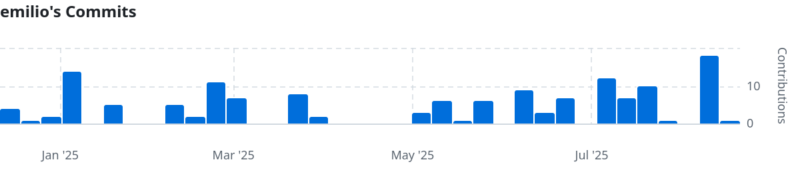

\chapter{Organización y gestión del proyecto}

# Organización

<!--
  La solución elegida se presenta en esta sección, indicando en qué consiste,
  las fases por las que se pasará para su desarrollo, cómo se va a implementar
  y validar (pruebas a realizar), etc.

  Se describirá cómo se han aplicado los métodos para realizar el proyecto,
  haciendo referencia a los anexos. Debe ser acorde a la metodología elegida y
  deberá incluir, al menos:

    * Una explicación de la arquitectura del sistema
    * Un diseño detallado y explicado sobre cada componente del sistema (base
      de datos, algoritmos, protocolos de comunicación, entidades, etc.)
    * Una descripción del desarrollo de la solución propuesta donde aparece
      cómo se ha pasado de la propuesta a la solución final, los problemas y
      dificultades encontrados, las decisiones que se han tenido que tomar, las
      particularidades de la solución final, etc.
    * Una descripción de las pruebas realizadas para verificar que la solución
      funciona correctamente.
-->

TODO

# Gestión del proyecto

<!--
  Se deben mencionar los recursos materiales o personales a utilizar y cómo se
  han configurado o diseñado, en caso necesario. Además, en este apartado se
  incluirá una breve descripción y un diagrama Gantt de la planificación
  temporal, con hitos, fases, etc.
-->

En esta sección se realiza una breve descripción de la planificación y los recursos
utilizados en el proyecto.

## Recursos materiales y personales

Los recursos materiales utilizados en el proyecto cubren el software y el
hardware necesarios para el desarrollo del proyecto.

El hardware utilizado para el desarrollo del proyecto han sido el ordenador
de sobremesa del autor, que ha permitido ejecutar el entorno de desarrollo y las
herramientas necesarias para el proyecto, y una variedad de teléfonos móviles
usados para probar la demo en Android, incluyendo los OnePlus 11 y 12 del
autor, y un Xiaomi de su pareja temporalmente.

Respecto al software, además de las herramientas de desarrollo (ver
\cref{sec:tooling}), se ha utilizado [Arch Linux](https://archlinux.org/) como
sistema operativo de desarrollo.

Como editores de código se han utilizado [Neovim](https://neovim.io/) y
[Android Studio](https://developer.android.com/studio).

Los recursos personales utilizados, por su parte, han sido el autor del
proyecto, Emilio Cobos Álvarez, y su tutor, Guillermo González Talaván.

Las responsabilidades del autor han abarcado el ciclo de vida completo del
proyecto, siendo el encargado de la planificación, diseño, desarrollo,
implementación, pruebas y documentación del mismo.

El tutor del proyecto ha sido el encargado de guiar al autor durante el proceso
de desarrollo, ayudando a definir los objetivos del proyecto, y revisando el
progreso del proyecto en las reuniones semanales de seguimiento.

## Planificación temporal

La planificación temporal del proyecto se resume en este apartado, pero se puede
ver de manera más detallada en el *Anexo III. Estimación del tamaño y esfuerzo*.

La planificación del proyecto se ha realizado siguiendo la metodología ágil
Scrum, de la cual se han descrito tanto su marco teórico como su implementación
práctica en el proyecto en el \cref{subsec:scrum}, y con mayor detalle en el
anexo tres.

El progreso en la implementación ha sido bastante intermitente por las
limitaciones temporales descritas en el \cref{subsec:scrum}. Se puede
ver una visualización de los [commits de cada
semana](https://github.com/emilio/ngn/graphs/contributors) a continuación:

Otro dato interesante (aunque también poco sorprendente), es el número de
commits por día de la semana, donde se puede ver que ha sido mayormente un
trabajo de fines de semana:

<!-- git log --format="%ad" | awk '{print $1}' | sort | uniq -c | awk '{print $1, $2}' | sort -rn -->

Día de la semana Commits
---------------- -------
Domingo          81
Sábado           28
Lunes            13
Miércoles        11
Jueves           7
Viernes          6
Martes           0

: Número de commits por día de la semana
