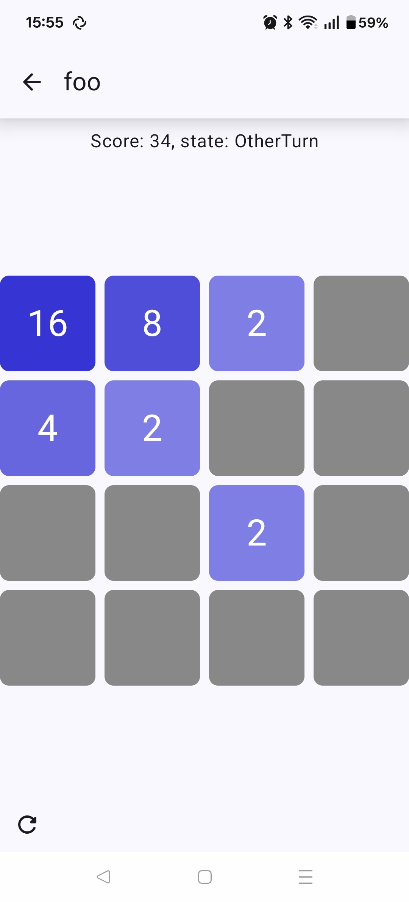

# Introducción

Todos tenemos una radio portátil.

. . .

**¡Pero no la usamos!**

---

# Ventajas de la comunicación P2P

## Privacidad

 * Tus datos no tienen que pasar por servidores centralizados.

## No necesita infraestructura

 * Usable en ubicaciones remotas
 * En caso de emergencia
 * O durante apagones 🫠

---

# La tecnología existe!

::: incremental

 * Bluetooth/LE
 * WiFi Aware o Neighbor Awareness Networking (NAN)
 * WiFi Direct
 * Apple Wireless Device Link (AWDL)
 * Sparklink (Huawei)

:::

---

# Usos actuales

::: incremental

 * Apps de *contact tracing* durante la pandemia usaban Bluetooth LE.
 * *FireChat* en las protestas de Hong Kong de 2014.
 * *Nearby Share* en Android usa WiFi Direct.
 * *AirDrop* usa AWDL.
 * Meshtastic.
 * MANETS de uso militar.

:::

---

# Hipótesis

Se hipotetiza que la baja adopción de este tipo de es por:

::: incremental

 * Dificultad de desarrollo.
 * Soporte para hardware variable.
 * Poca interoperabilidad entre plataformas.
 * Intereses económicos.

:::

---

# Propuesta

Se propone crear una biblioteca para facilitar el desarrollo de aplicaciones
P2P que:

::: incremental

 * Abstraiga la capa de transporte
 * Sea multi-plataforma
 * Funcione en dispositivos de consumo
 * Soporte autenticación
 * Cifre mensajes independiente de la capa de transporte

:::

. . .

Y una aplicación demostrativa.

---

# Herramientas

::: incremental

 * Lenguajes: Rust + Java + Kotlin (+ C)
 * Control de versiones: Git
 * UI: GTK, Jetpack Compose
 * Depuración: rr
 * Documentación: pandoc, \LaTeX, Mermaid, rustdoc

:::

---

# Metodología

Se ha elegido *Scrum* con sprints semanales como metodología de desarrollo
ágil (con algunas licencias para acomodar las restricciones existentes).

---

# Interfaz principal

```rust
#[async_trait::async_trait]
pub trait P2PSession: ... {
 async fn new(...,
  listener: Arc<dyn P2PSessionListener<Self>>
 ) -> GenericResult<Arc<Self>>;
 async fn discover_peers(&self) -> GenericResult<()>;
 async fn connect_to_peer(&self, id: PeerId)
  -> GenericResult<()>;
 async fn message_peer(&self, id: PeerId, msg: &[u8])
  -> GenericResult<()>;
}
```

---

# Conexión


---

# Seguridad

::: incremental

 * Identidad y firma de mensajes usando clave Ed25519
 * Generación de secreto usando ECDH X25519
 * Cifrado usando AES-256-GCM

:::

---

# Problemas I: Asignación de direcciones

::: incremental

 * Android usa IPv4 + DHCP por defecto.

 * IPv6 Neighbor discovery (ICMPv6): Requiere `CAP_NET_RAW` en Linux, imposible
   in Android.

 * IPv6 Link Local Address
   * Depende de la configuración del dhcp del GO.
   * Android no expone la dirección MAC de la interfaz.
   * Linux no expone la MAC del GO.

:::

---

# Problemas II: Linux

::: incremental

 * Permisos necesarios para interactuar con `wpa_supplicant`.
 * Interacción entre `NetworkManager` y `wpa_supplicant` (issue reportada).
 * API de D-Bus de `wpa_supplicant` subóptima:
   * Gestión de errores pobre (fix enviado y aceptado ✅)
   * No soporta auto-join (fix enviado y aceptado ✅)
   * No expone la MAC del dispositivo propio (fix enviado, pendiente)
   * No expone la MAC de la interfaz del GO (fix enviado, pendiente)
 * Configuración de dhcp (issue reportada y arreglada por upstream ✅).
 * Mejoras de rendimiento en zbus aceptadas ✅.

:::

---

# Problemas III: Android

::: incremental

 * Excesivos permisos necesarios.
 * Interacción de usuario requerida.
 * Soporte sólo para un grupo físico.
 * Servicios de ubicación activados necesario.
 * No expone MAC del dispositivo propio.
 * No expone MAC de la interfaz propia ni del GO.
 * Grupos previos almacenados global e indefinidamente.

:::

---

# Problemas IV: Pruebas

::: incremental

 * Imposible testear en un emulador.
 * Testear en Linux requiere:
   * Desconectar `NetworkManager`
   * Desconectar `wpa_supplicant`
   * Una instancia de `wpa_supplicant`, `dbus-daemon`, y `mac80211_hwsim` por
     cada nodo a controlar.

:::

---

# Demostración: Juego multijugador off-line



---

# Conclusiones

::: incremental

 * Interesante salir fuera de los estándares web y darse cuenta de que otras
   partes de la tecnología que usamos todos los días también son una casa de
   naipes 🫠.
 * Creo que hay hueco / demanda para una librería como la propuesta, si bien
   requiere mucho más trabajo de implementación (Windows, Bluetooth, WiFi aware...).
 * Hay mucho por hacer a nivel de plataforma e interoperabilidad también, la
   presión regulatoria via DMA puede mejorar la situación.
 * He aprendido mucho más de lo que esperaba haciendo este proyecto.

:::
